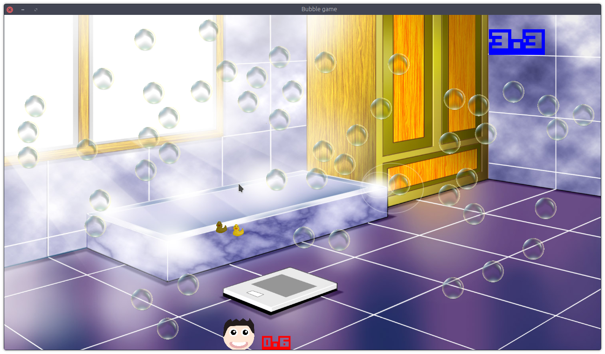

## Sinopsis
It is a simple 2d game demo with physics written in C++ using Unity3d-like gameobject/component system. I've tryed to make it easy to extend and to upgrade.
## Code example

1. Add new empty GameObject to game world.
```C++
  auto& newGameObject = scene.createGameObject();
```
2. Add Physics component to this object. All components require GameObject reference. And physComponent needs some physics info: mass, static or dynamic, is affected by gravity or not.
```C++
  newGameObject.addComponent("Physics", new PhysComponent(newGameObject, 0.0f, false, false));
```
3. We can get component from GO by name.
```C++
  const auto currentPhysComponent = newGameObject.getComponent<PhysComponent>("Physics")
```
4. Set the collider of physComponent.
```C++
  currentPhysComponent -> setCollider(Collider::rectangleCollider(sf::Vector2f(1.0f,3.0f));
```
5. Set GameObject's position.
```C++
  newGameObject.getTransform().position = sf::Vector2f(3.0f,4.0f);
```
## Installation
You will need SFML library to compile it.
### Ubuntu
```shell
sudo apt install libsfml-dev
git clone https://github.com/Cheburum/bubbly.git
cd ./bubbly/src
cmake .
make
```
## License
GPLv3 (look LICENSE file in repository).

## Screenshot

